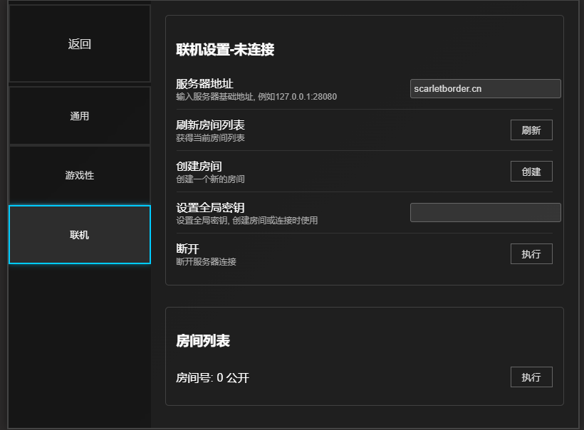
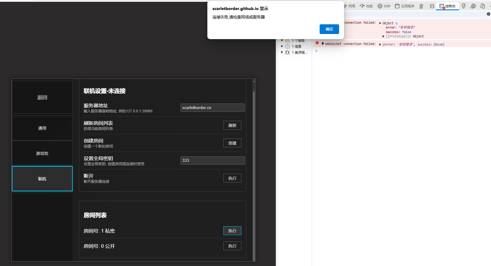
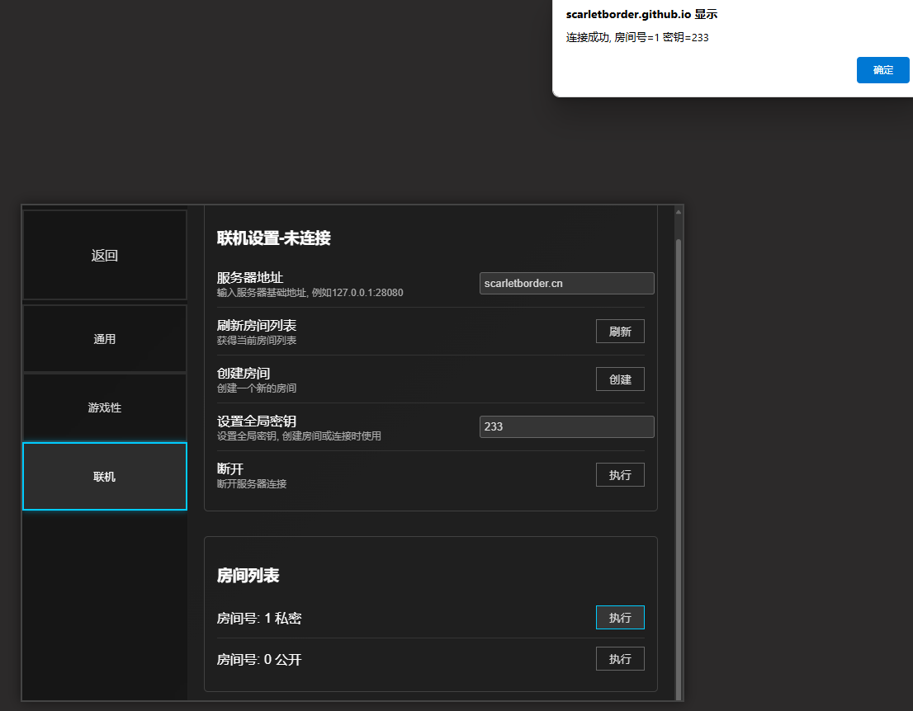

# 联机教程 cooperation mode tutorial

目前联机机制要求所有用户采用同一分辨率.

每次游戏结束都需要重新创建房间

## <del>连接公益服务器</del>

> [!IMPORTANT]
> 
> 由于成本问题，测试版本暂时停用了公益服务器，在此阶段参考下方自建服务器进行联机

在服务器地址输入联机服务器地基础地址. 目前有一台部署在美国洛杉矶地和一台部署在枣庄的公益云服务器,将域名填写进服务器地址输入框 点击刷新即可查看

- 山东枣庄(推荐)  `103.228.12.180:49870`
- 美国洛杉矶  `scarletborder.cn`

> [!WARNING]
>
> 美国公益服务器的延时较大,可能出现游戏中卡顿地现象可以考虑使用美国地区的加速器以提高体验.




## 证书问题

由于部分公益服务器为了节省成本用的是nat云,这种情况无法申请免费的https证书,因此使用了自建证书,这种情况下不能被浏览器信任,因此需要手动进行信任证书.

具体而言,浏览器前往`https://域名/list`例如 `https://103.228.12.180:49870/list`. 同时忽略风险继续访问,此时浏览器已经信任该证书.回到游戏中即可刷新房间列表或进入创建房间.

### 设置房间密钥

在全局密钥输入框中输入你要设置的房间密码. 该密码会作为所有的创建房间和尝试连接房间的密码

如果密钥错误,那么连接私密房间时会显示连接错误,但其实问题在于密码错误,该问题后续会解决



成功连接如下



## 后续游戏

成功连接后,创建房间的用户选择关卡进入选择器械的界面后,客人用户会直接进入选择器械的界面.

## 自建服务端

[服务端软件发布页面](https://github.com/mvz443-team/mvz443-server/releases)

服务端项目地址 [mvz443-server](https://github.com/mvz443-team/mvz443-server)

### 编译

```bash
go build -o mvzserver .
```

也可以使用项目里的 Makefile：

```bash
make build
```

新版服务端不再把证书文件内联进二进制，也不需要编译前手动生成 `certs`。如果启动时没有指定证书目录，服务端会在二进制所在目录下创建 `certs` 文件夹，并生成 `ssl.cert` 和 `ssl.key`。

### 命令参数

```bash
./mvzserver -v
./mvzserver -p 28080 -h 0.0.0.0
./mvzserver --new-local-certs /path/to/store
./mvzserver -c /etc/letsencrypt/live/scarletborder.cn -p 443
./mvzserver -l /path/to/store -p 28080
```

参数说明：

- `-v`：显示版本信息。
- `-p str`：监听端口，默认 `28080`。
- `-h str`：监听地址。不填写时监听所有地址；想明确允许局域网或公网访问，可以写 `0.0.0.0`。
- `--new-local-certs /path/to/store`：在指定目录生成新的 `ssl.cert` 和 `ssl.key`，生成后退出。
- `-c /path` 或 `--pem-certs /path`：使用包含 `cert.pem` 和 `privkey.pem` 的证书目录，适合 Certbot/Let's Encrypt。
- `-l /path` 或 `--local-certs /path`：使用包含 `ssl.cert` 和 `ssl.key` 的目录；如果文件不存在，服务端会自动生成。

注意：服务端始终使用 TLS 证书启动。使用自己生成的本地证书时，客户端可能需要手动信任证书；使用 Let's Encrypt 等受信任证书时通常不需要。

### 家用电脑：同一台电脑联机

如果客户端和服务端在同一台电脑上，直接启动：

```bash
./mvzserver
```

客户端连接：

```text
127.0.0.1:28080
```

首次启动时会在 `mvzserver` 二进制旁边自动创建 `certs/ssl.cert` 和 `certs/ssl.key`。

### 家用电脑：局域网联机

适合几台电脑在同一个 Wi-Fi/路由器下联机。

在开服电脑上启动：

```bash
./mvzserver -h 0.0.0.0 -p 28080
```

然后查看开服电脑的局域网 IP，例如：

- Windows：`ipconfig`，查看 IPv4 地址，例如 `192.168.1.23`
- Linux/macOS：`ip addr` 或 `ifconfig`

同一局域网内的其他客户端连接：

```text
192.168.1.23:28080
```

如果连不上，通常需要检查系统防火墙是否允许 `mvzserver` 或 TCP `28080` 端口入站。

### 家用电脑：端口映射联机

适合朋友不在同一个局域网，但你想用家里的电脑开服。

启动服务端：

```bash
./mvzserver -h 0.0.0.0 -p 28080
```

然后在路由器里添加端口映射/虚拟服务器/NAT 规则：

```text
外部 TCP 28080 -> 开服电脑局域网 IP 的 TCP 28080
```

例如：

```text
外部 TCP 28080 -> 192.168.1.23:28080
```

其他玩家连接你的公网 IP 或域名：

```text
你的公网IP:28080
```

如果运营商没有给你公网 IPv4，普通端口映射可能无效。这种情况可以尝试 IPv6、内网穿透、云服务器中转，或者直接使用有公网 IP 的专用服务器。

### 专用服务器：有域名和受信任证书

推荐给长期公开开服。先把域名解析到服务器 IP，然后用 Certbot 申请证书：

```bash
sudo certbot certonly
```

证书目录一般类似：

```text
/etc/letsencrypt/live/example.com
```

启动服务端：

```bash
sudo ./mvzserver -h 0.0.0.0 -p 443 -c /etc/letsencrypt/live/example.com
```

玩家连接：

```text
example.com:443
```

如果不想占用 443，也可以使用其他开放端口：

```bash
./mvzserver -h 0.0.0.0 -p 28080 -c /etc/letsencrypt/live/example.com
```

玩家连接：

```text
example.com:28080
```

### 专用服务器：没有域名或暂时不用正式证书

可以直接让服务端生成本地证书：

```bash
./mvzserver -h 0.0.0.0 -p 28080
```

或者把证书固定放到你指定的位置：

```bash
./mvzserver --new-local-certs /opt/mvzserver/certs
./mvzserver -h 0.0.0.0 -p 28080 -l /opt/mvzserver/certs
```

玩家连接：

```text
服务器IP:28080
```

这种方式使用的是自生成证书，客户端需要信任该证书后才能正常连接。
